<div align="center">
    
# 💎 Safekeep NGO Vault
### Secure Multi-Tenant File Management System with Intelligent Compression

[](https://python.org)
[](https://fastapi.tiangolo.com/)
[](https://streamlit.io/)
[](https://docker.com)
[](https://terraform.io)
[](https://aws.amazon.com)
[](LICENSE)

_A production-ready SaaS platform that combines automated file compression, tenant isolation, and cloud-native architecture for NGO document management._

[**📖 Documentation**](docs/) · [**🚀 Live Demo**](#) · [**🎯 Quick Start**](#-quick-start)

</div>

---

## 🌟 Overview

**Safekeep NGO Vault** is a secure, multi-tenant file management system designed specifically for Non-Governmental Organizations. Built with modern DevOps practices, it automatically compresses files (40-70% savings), enforces strict tenant isolation, and provides comprehensive audit logging for compliance.

Unlike generic file storage solutions, Safekeep was **built from the ground up** to solve real-world NGO challenges: limited storage budgets, compliance requirements, and the need for role-based access control across multiple organizations.

> **Why build this?**
> To create a production-ready SaaS application demonstrating full-stack development, cloud infrastructure automation, multi-tenant architecture, and DevOps best practices—not by using templates, but by implementing security, compression, and isolation from first principles.

---

## ✨ Key Features

| Feature | Description |
| :--- | :--- |
| 🔐 **Multi-Tenant Isolation** | Complete data separation between organizations using JWT authentication and database-level filtering. |
| 🗜️ **Intelligent Compression** | Automatic PDF (Ghostscript) and image (Pillow) compression achieving 40-70% storage savings. |
| 👥 **Role-Based Access** | Separate Admin and Staff portals with granular permissions and user management. |
| 📊 **Audit Logging** | Immutable activity logs for compliance (Login, Upload, Delete, Share) with IP tracking. |
| 🔗 **Secure Sharing** | Time-limited presigned S3 URLs (1-hour expiration) for temporary file access. |
| ☁️ **Cloud-Native** | Terraform-managed AWS infrastructure (S3, Lambda) with containerized deployment. |
| 🐳 **Production Ready** | Multi-stage Docker builds, PostgreSQL support, and automated CI/CD pipelines. |

---

## 🏗️ Architecture

The system follows a modern microservices architecture with clear separation between frontend, backend, and cloud infrastructure.

```mermaid
graph TB
    subgraph "Client Layer"
        User[👤 User Browser]
    end
    
    subgraph "Application Layer"
        Frontend[🎨 Streamlit Frontend<br/>Multi-Page App]
        Backend[⚡ FastAPI Backend<br/>REST API]
    end
    
    subgraph "Data Layer"
        DB[(🗄️ PostgreSQL<br/>User & Metadata)]
        S3[☁️ AWS S3<br/>File Storage]
    end
    
    subgraph "Processing Layer"
        Lambda[⚙️ AWS Lambda<br/>Image Processor]
        Compression[🗜️ Compression Engine<br/>Ghostscript + Pillow]
    end
    
    User -->|HTTPS| Frontend
    Frontend -->|JWT Auth| Backend
    Backend -->|SQLAlchemy| DB
    Backend -->|boto3| S3
    Backend -->|Compress| Compression
    S3 -->|Trigger| Lambda
    Lambda -->|Optimize| S3
    
    style Frontend fill:#FF4B4B
    style Backend fill:#009688
    style DB fill:#336791
    style S3 fill:#FF9900
    style Lambda fill:#FF9900
    style Compression fill:#4B8BBE
```



### Data Flow


---

## 🚀 Quick Start

### Prerequisites
- **Docker & Docker Compose** (recommended)
- **Python 3.11+** (for local development)
- **AWS Account** (for S3 storage)
- **Terraform** (for infrastructure provisioning)

### Installation

#### 1️⃣ Clone the Repository
```bash
git clone https://github.com/2004Asbah/safekeep-vault.git
cd safekeep-vault
```

#### 2️⃣ Configure Environment
Create a `.env` file with your AWS credentials:
```bash
cp .env.example .env
# Edit .env with your AWS credentials
```

Required variables:
```bash
AWS_ACCESS_KEY_ID=your_access_key
AWS_SECRET_ACCESS_KEY=your_secret_key
S3_BUCKET_NAME=your-bucket-name
JWT_SECRET=your-super-secret-key
```

#### 3️⃣ Provision AWS Infrastructure
```bash
cd terraform
terraform init
terraform apply
# Note the S3 bucket name from outputs
```

#### 4️⃣ Start the Application
```bash
# Using Docker Compose (recommended)
docker-compose up

# Access the application:
# Frontend: http://localhost:8501
# Backend API: http://localhost:8000
# API Docs: http://localhost:8000/docs
```

#### 5️⃣ Initialize Database
```bash
# First-time setup
docker-compose exec backend python reset_database.py
```

---

## 📸 Screenshots

### 1️⃣ Multi-Tenant Login
Separate portals for Admin and Staff with automatic role detection.


### 2️⃣ Admin Dashboard
Real-time metrics, storage analytics, and system health monitoring.


### 3️⃣ File Upload with Compression
Automatic compression with real-time progress and savings calculation.


### 4️⃣ Vault Explorer
Search, filter, download, and share files with presigned URLs.


### 5️⃣ Audit Logs
Immutable compliance logs with filtering and export capabilities.


---

## 🛠️ Tech Stack

### Frontend
- **Streamlit** - Interactive multi-page web application
- **Custom CSS** - Glassmorphism design system
- **Python 3.11** - Application logic

### Backend
- **FastAPI** - High-performance REST API
- **SQLAlchemy** - ORM with PostgreSQL/SQLite support
- **Pydantic** - Data validation and serialization
- **JWT** - Stateless authentication
- **bcrypt** - Password hashing

### Storage & Processing
- **AWS S3** - Scalable object storage
- **Ghostscript** - PDF compression (40-60% reduction)
- **Pillow** - Image optimization (50-70% reduction)
- **boto3** - AWS SDK for Python

### Infrastructure
- **Terraform** - Infrastructure as Code
- **Docker** - Containerization with multi-stage builds
- **PostgreSQL** - Production database
- **AWS Lambda** - Serverless image processing

### DevOps
- **GitHub Actions** - CI/CD pipelines
- **Docker Compose** - Local development orchestration
- **pytest** - Automated testing

---

## 📁 Project Structure

```
safekeep-vault/
├── backend/                    # FastAPI Backend
│   ├── routes/                # API endpoints
│   │   ├── auth_routes.py    # Authentication
│   │   ├── file_routes.py    # File operations
│   │   └── audit_routes.py   # Audit logs
│   ├── models.py              # Database models
│   ├── auth.py                # JWT & password hashing
│   ├── compression_engine.py  # File compression
│   ├── s3_service.py          # AWS S3 integration
│   └── dependencies.py        # Auth middleware
│
├── frontendd/                 # Streamlit Frontend
│   ├── app.py                 # Main application
│   ├── pages/                 # Multi-page app
│   │   ├── 1_Dashboard.py
│   │   ├── 2_Upload_Center.py
│   │   ├── 3_Vault_Explorer.py
│   │   ├── 4_Audit_Logs.py
│   │   └── 5_User_Management.py
│   ├── components.py          # Reusable UI components
│   ├── services.py            # API client
│   └── styles.css             # Custom styling
│
├── terraform/                 # Infrastructure as Code
│   ├── main.tf                # AWS resources
│   ├── variables.tf           # Configuration
│   └── outputs.tf             # Resource outputs
│
├── docs/                      # Documentation
│   ├── DEPLOYMENT.md          # Deployment guide
│   └── API.md                 # API reference
│
├── tests/                     # Test suite
├── docker-compose.yml         # Local development
├── Dockerfile                 # Container image
├── .env.example               # Environment template
└── README.md                  # This file
```

---

## 🧪 Testing

```bash
# Run backend tests
cd backend
pytest

# Run with coverage
pytest --cov=. --cov-report=html

# View coverage report
open htmlcov/index.html
```

---

## 🚢 Deployment

### Option 1: AWS (Full Infrastructure)

```bash
# 1. Provision infrastructure
cd terraform
terraform apply

# 2. Deploy to EC2/ECS
# See docs/DEPLOYMENT.md for detailed steps
```

**Cost**: ~$10/month (after free tier)

### Option 2: Render.com (Free Tier)

```bash
# 1. Push to GitHub
# 2. Connect repository to Render
# 3. Deploy backend + frontend services
# 4. Add PostgreSQL database
```

**Cost**: $0/month (free tier)

See [**Deployment Guide**](docs/DEPLOYMENT.md) for detailed instructions.

---

## 🔒 Security Features

- ✅ **JWT Authentication** - Stateless, secure token-based auth
- ✅ **Password Hashing** - bcrypt with salt rounds
- ✅ **Tenant Isolation** - Database-level filtering by NGO
- ✅ **Audit Logging** - Immutable compliance trail
- ✅ **S3 Encryption** - AES-256 encryption at rest
- ✅ **Presigned URLs** - Time-limited file sharing (1 hour)
- ✅ **Input Validation** - Pydantic schemas for all requests

---

## 📊 Performance Metrics

| Metric | Value |
|--------|-------|
| **Compression Ratio** | 40-70% storage savings |
| **API Response Time** | <100ms (average) |
| **File Upload** | Supports up to 100MB |
| **Concurrent Users** | 100+ (worker pool) |
| **Database** | PostgreSQL with connection pooling |

---

## 🤝 Contributing

Contributions are welcome! Please read [**CONTRIBUTING.md**](CONTRIBUTING.md) for details on our code of conduct and the process for submitting pull requests.

---

## 📄 License

This project is licensed under the MIT License - see the [**LICENSE**](LICENSE) file for details.

---

## 🙏 Acknowledgments

- Built with [Streamlit](https://streamlit.io/) for rapid frontend development
- Powered by [FastAPI](https://fastapi.tiangolo.com/) for high-performance APIs
- Infrastructure managed with [Terraform](https://www.terraform.io/)
- File storage by [AWS S3](https://aws.amazon.com/s3/)
- Compression via [Ghostscript](https://www.ghostscript.com/) and [Pillow](https://python-pillow.org/)

---

## 📧 Contact

**Aditya Bhatt** - [GitHub](https://github.com/2004Asbah)

**Project Link** - [https://github.com/2004Asbah/safekeep-vault](https://github.com/2004Asbah/safekeep-vault)

---

<div align="center">
<sub>Built with ❤️ and ☕ for NGOs worldwide</sub>
</div>
